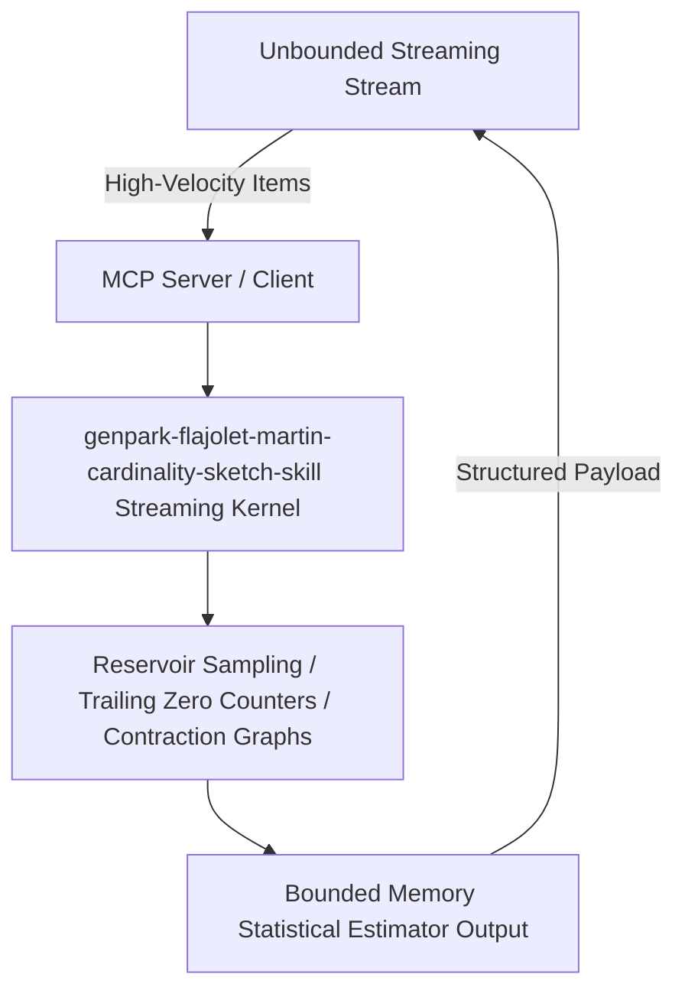

# genpark-flajolet-martin-cardinality-sketch-skill

[](https://github.com/alphaparkinc/genpark-flajolet-martin-cardinality-sketch-skill)
[](https://python.org)
[](#)
[](#)
[](LICENSE)

> Flajolet-Martin (FM) distinct elements streaming sketch estimating unique cardinality from trailing zero bit patterns with logarithmic memory.

## Architecture Overview



## Features
- **0 External Pip Dependencies**: Pure Python standard library implementation.
- **MCP Protocol Ready**: Includes Model Context Protocol server script (`mcp_server.py`).
- **Production Standard**: Probabilistic bounds and optimal space complexity.

## Quick Start
```bash
python example_usage.py
```
